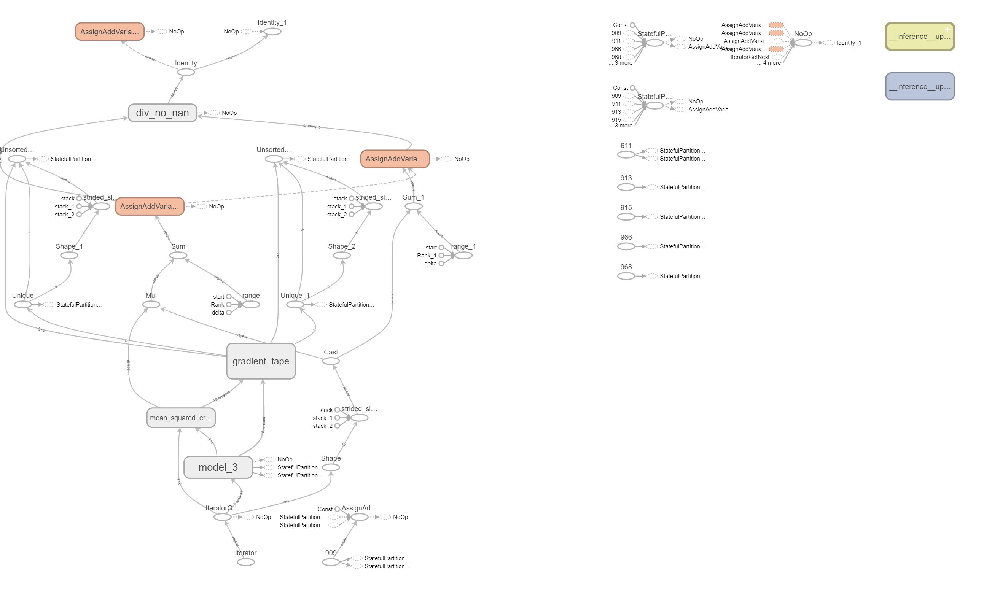

# Recommendation-System (3 Approaches)
Here, we try to create a recommendation system containing 'user_id', item_id, and 'ratings' of the items (products) using 3 different approaches and also, trying to merge a few of them for better performance! The three approaches are:

#### `Sample Architecture:`

======

## 1. Graph Convolutional Network with Item-based Collaborative Filtering:
This approach combines the power of graph convolutional networks (GCN) with item-based collaborative filtering to make recommendations. The GCN component is used to learn a representation of the user-item interaction graph, which captures the relationships between users and items, and is then combined with item-based collaborative filtering to make personalized recommendations. The benefits of this approach include:

* The ability to capture complex relationships between users and items, including implicit feedback.
* The ability to handle large-scale datasets, making it suitable for applications with a large number of users and items.
* Incorporates additional features, such as user and item attributes, into the model.

The main disadvantage of this approach is that it can be computationally expensive and requires a large amount of data to train the GCN.

## 2. Multi-layer Perceptron:
The multi-layer perceptron (MLP) is a feedforward neural network that can be used to make recommendations. The MLP takes user and item features as input and learns a non-linear mapping between them to predict user-item interactions. The benefits of this approach include:

* The ability to capture non-linear relationships between users and items, making it suitable for applications with complex user-item interactions.
* The ability to incorporate additional features, such as user and item attributes, into the model.
* The ability to handle large-scale datasets, making it suitable for applications with a large number of users and items.

The main disadvantage of this approach is that it can be prone to overfitting, especially when the number of parameters in the model is large.

## 3. User-User Collaborative Filtering:
This approach is based on the idea that users who have similar preferences for items are likely to have similar preferences for other items. User-user collaborative filtering works by finding users who are similar to the target user based on their historical item ratings and making recommendations based on items that those similar users have rated highly. The benefits of this approach include:

* The ability to make personalized recommendations even when there is limited information about the user or the items.
* The ability to capture user preferences for niche items that may not be popular among the general population.
* The ability to handle sparse datasets, making it suitable for applications with a limited number of ratings.

The main disadvantage of this approach is that it can be computationally expensive, especially when there are many users in the system. Additionally, it may not perform well for users with unique preferences or for items with few ratings.

